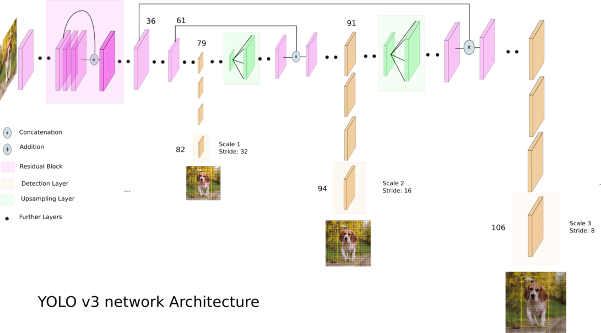
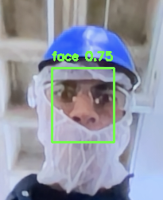

# YOLO Face Detection with OpenCV

This Python script uses the YOLO (You Only Look Once) model implemented with OpenCV for real-time face detection in a webcam feed.

## Features

- Real-time face detection using a pre-trained YOLO model.
- Draws bounding boxes and labels around detected faces.
- Adjustable confidence threshold and non-maximum suppression parameters.

## Prerequisites

- Python 3.x
- OpenCV (`pip install opencv-python`)
- YOLO weights file (`yolov3-wider_16000.weights`)
- YOLO configuration file (`yolov3-face.cfg`)
- Class names file (`face.names`)

## Usage

1. Clone this repository to your local machine.

2. Download the YOLO weights file (`yolov3-wider_16000.weights`) and the YOLO configuration file (`yolov3-face.cfg`).

3. Create a text file named `face.names` with the class names (e.g., "face" in this case) for labeling the detected objects.

4. Run the `yolo_face_detection.py` script to start real-time face detection using your webcam.

```bash
python yolo_face_detection.py
```

## Architecture & Demo



## Contributing

Contributions are welcome! If you have any ideas, open an issue or submit a pull request.

## License

This project is licensed under the MIT License 

---

You can use this description and README as a starting point for your GitHub repository, and modify it as needed to provide more specific information about your project. Be sure to include relevant links, such as links to the YOLO model weights and configuration files, and update any paths or details to match your project's structure.
